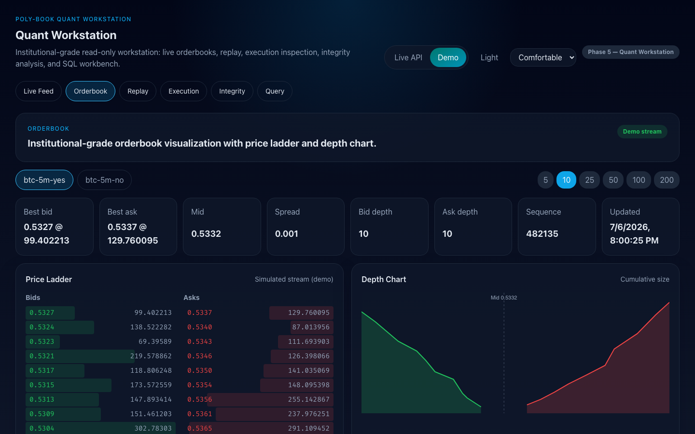

# poly-book

[](https://github.com/weiminglong/poly-book/actions/workflows/ci.yml)
[](https://github.com/weiminglong/poly-book/actions/workflows/supply-chain.yml)
[](LICENSE)

A production-grade market-data system for Polymarket order books, written in
Rust: lock-free single-writer ingestion over zero-copy WebSocket
deserialization, an embedded CRC-framed write-ahead log with torn-tail crash
recovery and flock-based writer failover, split Parquet + ClickHouse storage,
deterministic point-in-time book reconstruction, and a read-only quant
workstation (HTTP/WS/gRPC + React UI) on top.

**[Live demo](https://weiminglong.github.io/poly-book/)** — the workstation UI
in the browser, no install. Or fully offline with real captured market data:
`just demo`.



Measured hot-path medians (Apple M3, full context and 49-benchmark table in
[docs/PERFORMANCE.md](docs/PERFORMANCE.md)):

| Operation | Median | Rate |
|---|---|---|
| Book delta apply | 9 ns | 108 M/s |
| WAL codec encode | 87 ns | 11.5 M/s |
| WAL append + flush | 509 ns/record | 2.0 M/s |
| Dispatcher normalize + shadow-book cross-check | 484 ns/entry | 2.1 M/s |
| WS `price_change` deserialize (zero-copy) | 504 ns | 2.0 M/s |
| Read-model snapshot (50 levels) | 154 ns | 6.5 M/s |

## Review this repo in 15 minutes

1. **[Live demo](https://weiminglong.github.io/poly-book/)** or `just demo` —
   see it run (10 seconds / one command).
2. **[crates/pb-wal/README.md](crates/pb-wal/README.md)** — the embedded WAL:
   CRC-over-length framing, torn-tail truncation on recovery, single-writer
   `flock` that doubles as failover, independent tailing consumers.
3. **[TESTING.md](TESTING.md)** — the failure-mode → defense matrix: 762
   tests, 35 property suites, 6 fuzz targets, miri, offline alert-rule
   incident tests, and an honest list of what is not yet covered.
4. **[docs/PERFORMANCE.md](docs/PERFORMANCE.md)** — measured, machine-stamped
   numbers for every pipeline stage.
5. **[research/orderbook_analysis.ipynb](research/orderbook_analysis.ipynb)** —
   microstructure analytics (order-flow imbalance, microprice, realized
   spread) computed straight off the committed Parquet capture.
6. **[docs/adr/](docs/adr/)** — eleven ADRs from fixed-point arithmetic to the
   read-only workstation boundary, each with alternatives and tradeoffs.

## Project Status

An active personal project, open to outside contributions. The ingestion,
durability, and replay paths are working and heavily tested; APIs and storage
layout may still evolve. Start with [CONTRIBUTING.md](CONTRIBUTING.md).

## Quickstart

### One command (offline, no Docker)

```bash
just demo        # or: cargo run --release -- demo
```

Replays a committed capture of real Polymarket BTC-5-minute market data as a
simulated live feed behind the full API — the book ticks at its original
cadence, and replay/integrity/execution answer from the capture. No network,
no venue dependency, deterministic. The startup banner prints copy-paste
`curl` examples with known-good timestamps.

### Research quickstart

The same capture is a research dataset: plain hour-partitioned Parquet with a
documented schema. [`research/orderbook_analysis.ipynb`](research/orderbook_analysis.ipynb)
is an executed notebook (renders on GitHub) computing microstructure analytics
over it — mid/spread, microprice, order-flow imbalance vs price moves, trade
flow, and binary-outcome pinning — with polars + matplotlib only; see
[`research/README.md`](research/README.md) for a one-line runner. For the API
surface, [`examples/api-cookbook.md`](examples/api-cookbook.md) has one
captured request/response example per route, all runnable offline against
`just demo`.

### One command (Docker, live venue)

```bash
docker compose --profile minimal up --build
# open http://localhost:3000 — live feed + API + workstation UI in one container
```

The `full` profile runs the production process separation (ingest + serve over
a shared WAL volume, plus ClickHouse), and `observability` adds
Prometheus/Alertmanager/Grafana with the committed dashboard. See
[docs/operations.md](docs/operations.md) for all three topologies.

### Prerequisites (from source)

- [Rust](https://rustup.rs/) 1.94+
- Docker for the full integration suite
- `just` is optional
- `duckdb` is optional for Parquet inspection
- ClickHouse is optional unless you want warm-storage testing

### Build

```bash
cargo build
```

### Fast Local Validation

```bash
cargo test --workspace --exclude pb-integration-tests
```

### Full Validation

```bash
just ci
```

This runs formatting, Clippy, and the full test suite. The integration package
includes ClickHouse round-trip coverage through `testcontainers`, so Docker must
be available.

### Integration Tests

Integration tests live in `pb-integration-tests` and require Docker (for
ClickHouse via testcontainers). They are excluded from the default test run:

```bash
# Run integration tests locally (requires Docker)
cargo test -p pb-integration-tests -- --test-threads=1
```

### Copy-Paste Demo

```bash
cargo run -- discover --filter btc --limit 5
```

Expected output shape:

```text
--- Live BTC 5-minute market ---
Event: <event title>
  Market: <market question>
    Token IDs: <yes_token_id>,<no_token_id>
    Active: true
```

The exact market title and token IDs change over time.

## Common Workflows

### Discover markets

```bash
just discover
# or
cargo run -- discover --filter btc --limit 100
```

### Auto-discover and ingest

```bash
just auto-ingest
# or
cargo run -- auto-ingest
```

Continuously rotates to the live BTC 5-minute market and ingests data.

### Ingest known token IDs

```bash
just ingest <TOKEN_ID>
# or
cargo run -- ingest --tokens <TOKEN_ID> --parquet --metrics
```

### Replay historical state

```bash
just replay <TOKEN_ID> <TIMESTAMP_US>
# or
cargo run -- replay --token <TOKEN_ID> --at <TIMESTAMP_US> --source parquet --mode recv_time
```

Replay modes:

- `recv_time` reproduces local observation order
- `exchange_time` reorders by venue timestamp, then receive time, then sequence

Add `--validate` to compare replay output against the next checkpoint.

### Serve the workstation API

```bash
cargo run -- serve-api --tokens <TOKEN_ID>
# or
cargo run -- serve-api --auto-rotate
```

This starts the read-only API layer for the quant workstation backend. The
first release serves live feed status, active assets, live book snapshots, and
Parquet-backed replay reconstruction.

### Run the workstation SPA

```bash
cd web
nvm use
npm ci
npm run dev
```

By default the Vite dev server binds `127.0.0.1:4173` and proxies `/api`
requests to `http://127.0.0.1:3000`, so you can run it alongside
`cargo run -- serve-api --auto-rotate`. Set `VITE_DEV_HOST=0.0.0.0` only for an
intentional LAN-exposed dev session. The shipped SPA currently includes `Live Feed`, `Replay Lab`, `Integrity`,
and `Execution Timeline`. Append
`?source=demo` to the URL or use the in-app toggle to review seeded sample data
without a running backend. The SPA uses a newer Node runtime than the Rust-only
workspace commands; see [`web/README.md`](web/README.md) for the exact supported
version and validation flow.

### Replay execution history

```bash
cargo run -- execution-replay --start <START_US> --end <END_US> --source parquet
```

### Backfill checkpoints

```bash
just backfill <TOKEN_ID>
# or
cargo run -- backfill --tokens <TOKEN_ID> --interval-secs 60
```

### Inspect local Parquet output

```bash
just parquet-stats
just parquet-peek
just parquet-schema
```

## Performance & Correctness

The full failure-mode → defense matrix — which layer catches which class of
bug, with real counts and run commands — lives in [TESTING.md](TESTING.md).

### Benchmarks

Measured results — hardware- and commit-stamped medians for every hot-path
stage (wire deserialize, dispatcher normalize, WAL append, book ops, read
model) — live in [docs/PERFORMANCE.md](docs/PERFORMANCE.md), regenerated with
`just bench-report`; the headline medians are in the table at the top of this
README.

```bash
cargo bench                 # all benchmarks
cargo bench -p pb-types     # fixed-point ops + wire deserialization throughput
cargo bench -p pb-book      # book operations, depth iteration, mixed workloads
just bench-report           # full suite + regenerate docs/PERFORMANCE.md
```

### Property-Based Testing

The `pb-types` and `pb-book` crates include `proptest` suites that verify
invariants across randomized inputs:

- fixed-point roundtrip, ordering, and serde consistency
- bid/ask ordering preserved after arbitrary snapshots and deltas
- spread never negative for non-crossed books
- mid price and weighted mid price bounded by best bid/ask
- sequence monotonicity and gap detection soundness
- snapshot idempotency
- crossed-book detection via `check_integrity()`
- total size consistency across all levels

### Fuzzing

Fuzz targets under `fuzz/` cover deserialization and book mutation:

```bash
cargo +nightly fuzz run fuzz_ws_deser       # wire protocol parsing
cargo +nightly fuzz run fuzz_fixed_price     # FixedPrice/FixedSize parsing
cargo +nightly fuzz run fuzz_book_delta      # book delta application invariants
cargo +nightly fuzz run fuzz_query_guard     # SQL query guard sanitizer + LIMIT normalization
```

### Latency Design

Key design choices documented in [docs/latency.md](docs/latency.md) and
[docs/adr/](docs/adr/):

- Fixed-point arithmetic eliminates FPU stalls and NaN guards (ADR-0001)
- BTreeMap book: best bid/ask in ~3 ns measured, benchmarked against a dense-array alternative (ADR-0002)
- Channel-based message passing avoids locks on the hot path (ADR-0003)
- Zero-copy wire deserialization reduces allocations (ADR-0004)
- mimalloc global allocator for lower p99 latency (ADR-0005)
- FxHashMap in Dispatcher for faster internal lookups (ADR-0006)

## Why This Repo Exists

The project demonstrates a specific style of trading-infrastructure design:

- fixed-point numeric types instead of heap-heavy decimal math
- single-threaded book mutation on the hot path
- bounded channels and backpressure between components
- typed, split datasets instead of one overloaded event stream
- replay and validation as first-class storage consumers

## Architecture

```text
Polymarket WS -> pb-feed -> pb-wal -> pb-store -> Parquet / ClickHouse
                 |            |                    ^
                 v            v                    |
              pb-api <---- pb-service <-- pb-replay --+
                 |
                 +-> workstation clients
                 |
                 +-> pb-metrics
```

For detailed data flow diagrams, crate dependency graphs, and runtime topology,
see [docs/architecture.md](docs/architecture.md).

Workspace crates:

| Crate | Responsibility |
|-------|----------------|
| `pb-api` | Read-only HTTP API and live read model for workstation clients |
| `pb-types` | Fixed-point types, wire formats, and persisted records |
| `pb-book` | In-memory L2 order book engine with analytics (weighted mid, top-N, integrity checks) |
| `pb-feed` | WebSocket ingest, REST discovery, dispatcher, rate limiting |
| `pb-store` | Parquet and ClickHouse sinks |
| `pb-replay` | Historical replay, checkpoint reconstruction, validation, backfill |
| `pb-wal` | Embedded write-ahead log with append-only segments and CRC32C framing |
| `pb-service` | Transport-neutral domain service layer with configurable backends |
| `pb-grpc` | gRPC read surface using tonic (optional, delegates to pb-service) |
| `pb-metrics` | Prometheus metrics endpoint |
| `pb-bin` | CLI entrypoint |

## Configuration

Runtime config is layered:

1. `config/default.toml`
2. environment variables prefixed with `PB__`
3. CLI flags

Example:

```bash
PB__LOGGING__LEVEL=debug cargo run -- auto-ingest
```

Operational details, deployment notes, infrastructure setup, and data layout live
in [docs/operations.md](docs/operations.md).

Current workstation API routes and runtime notes live in:

- [docs/api.md](docs/api.md)
- [docs/serve-api.md](docs/serve-api.md)
- [web/README.md](web/README.md)

## Roadmap

Near-term work that would make strong public contributions:

- broader replay validation and determinism coverage
- workstation integrity, latency, execution, and query expansion beyond the
  current Live Feed + Replay Lab SPA slice
- more explicit schema/versioning guarantees for persisted datasets
- clearer operational docs for ClickHouse and cloud object storage
- examples for strategy hooks and execution-event workflows

## Development Workflow

This repository uses [OpenSpec](https://github.com/Fission-AI/OpenSpec) for larger
feature work. Archived proposals, designs, specs, and tasks live under
`openspec/changes/archive/`.

### Engineering process

This project is built AI-assisted under human design direction and review.
Correctness does not rest on review alone: every change passes hard
verification gates — the full test suite (fuzzing, property tests, miri,
golden byte fixtures, offline alert-rule incident simulations; see
[TESTING.md](TESTING.md)), adversarial review passes hunting for bugs rather
than confirming intent, and live end-to-end verification against the real
venue before merge. Design decisions and their rejected alternatives are
recorded in [docs/adr/](docs/adr/) and the archived OpenSpec changes rather
than in tooling history.

For contribution standards and PR expectations, see:

- [CONTRIBUTING.md](CONTRIBUTING.md)
- [CODE_OF_CONDUCT.md](CODE_OF_CONDUCT.md)
- [SECURITY.md](SECURITY.md)
- [CHANGELOG.md](CHANGELOG.md)
- [docs/releasing.md](docs/releasing.md)

## License

[MIT](LICENSE)
